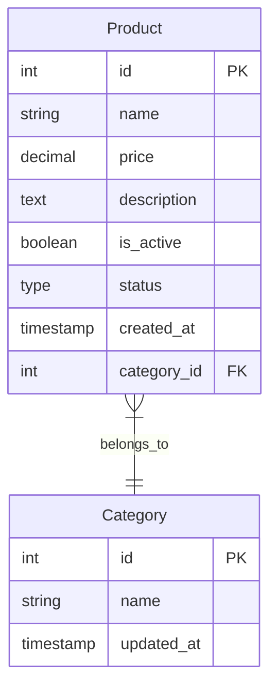

# 🔄 Mermaid-to-Django

Convert Mermaid ER diagrams to Django models instantly

## 🌟 Features

- Live preview of ER diagrams
- Instant conversion to Django models
- Supports common field types:
  - Integer & Decimal fields
  - String & Text fields
  - Boolean fields
  - Timestamps
  - Choice fields with enums
- Handles relationships and foreign keys
- Generates model meta classes
- Creates smart __str__ methods

## 🚀 Usage

1. Visit [https://abe-101.github.io/mermaid-to-django](https://abe-101.github.io/mermaid-to-django)
2. Paste your Mermaid ER diagram in the left panel
3. See the live preview update automatically
4. Get your Django models in the right panel

### Example Input

## 🛠️ Development

To run locally:

1. Clone the repository
2. Open `index.html` in your browser
3. Make changes and refresh to see updates

## 📄 License

MIT License

## 🤝 Contributing

Contributions are welcome! Please feel free to submit a Pull Request.
